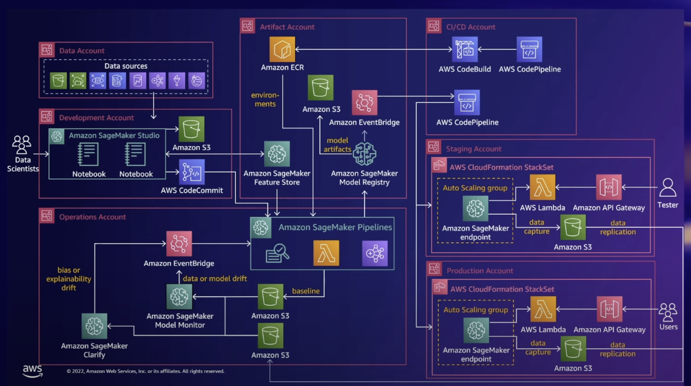

# AWS MLOPS INFRASTRUCTURE

A cloud solution for a Machine Learning Platform , that utilizes AWS to deploy Machine Learning models. All while following DevOps Principles to ML Systems , such as continuous delivery and monitoring at all steps of ML system construction , including integration, testing , releasing, deployment and infrastructure managment.

The architecture should be capable of deploying a regression ml model , and collect accuracy metrics regarding the model.

## Requirements Overview

- Infrastructure should implement concepts of IAM Security, Scalability to deliver new ML models.
- It should help a team of Data Engineers, easily run datapipelines and store the results to be shared with the data scientist team.
  - Only data engineers need to have access to the data sources, and data scientists will only consume the data.
- It should provision a developing environment (Jupyter Notebooks) for data scientists, to create ML model. It should be capable of adding more environments in the future , if the team expands.
  - The jupyter notebooks should have access to a version controlled git repository , to save their code. Upon every merge to the main branch of the repo , a MLOPS pipeline should be triggered that takes the latest ML model , containerizes it and then deploys to a staging environment.
  - Before deploying to production , each model should be :
    1. Evaluated
    2. Validated
    3. Registered and Containerized - Each new model should be appropriatly versioned.
- Once a Pipeline has been triggered a anyone from the team should not be able to stop it, and only a new merge into the code repo should trigger a new pipeline.
- Model registry - Models should be stored in the registry with this version V<Model_Tag>.<Manual_Model_Revision>.<Auto_model_revsion>
  - Manual Model Revision - When a model is revised by a data scientist to improve Accuracy.
  - Auto Model Revision - When a model is revised automatically, due to new availability of data.
- Staging Environment - Utilize <u>shadow depoloyment</u> to capture the model accuracy from real time requests, in the staging environment.
- Release Strategy - Once a model performs well in the staging environment, use <u>Gradual Rollout</u> strategy to release the new model to production.
- Monitoring - Features should be implemented to capture and display model accuracy (MSE , RMSE , MAE and R^2 values).
- Alerts - Alerts should be triggered when the quality of model is deviated from expectations.

## Automation Challenge

## Infrastructure Diagram

## Articles Referenced:

1. [Google mlops Continuous Delivery and Automation Pipelines](https://cloud.google.com/architecture/mlops-continuous-delivery-and-automation-pipelines-in-machine-learning)

   
